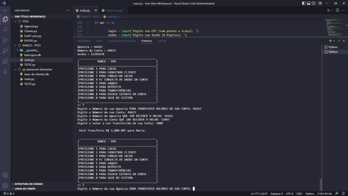

# Sistema Bancário Python - POO (Programação Orientada a Objetos)

 

## 👨‍💻 Sobre o projeto:

Bibliotecas Usadas:
- pyodbc
- randint from random
- datetime
- pytz

<strong>Funcionalidades até o exato momento:</strong>
 

Integração com Banco de Dados sqlite3
  - Nome, cpf, Agencia, Numero da conta, Saldo, Limite, Senha, Validação

* Numero da conta e da Agencia é gerado aleatoriamente

* Login é validado no Banco de Dados

* É possível a consulta do saldo do Usuário

* Não é possível fazer nenhuma das opções antes de se Logar

* Limite para saque e depóstio (em testes)

 

O Projeto é um Sistema Bancário, onde o usuário pode:

- Fazer Depositos
- Fazer Saques
- Fazer Transferências
- Exibir Extrato Bancário
- Exibir Saldo Atual
- Exibir Dados da conta

 

Além disso O Sistema conta com certas funcionalidades como:

- Integração total com Banco de Dados
- Logica de "cheque especial"
- Cadastro com regras próprias do sistema

Esta é uma versão inicial do Projeto, Pretendo ainda implementar uma interface e outras melhorias.

 

Para testa-lo:

Ter as Mesmas Bibliotecas Usadas nesse projeto.

Driver Sqlite3 Instalado

IDE python para rodar o código

-------------------------------------------------

### 🚀 Tecnologias Utilizadas:

  </img>

